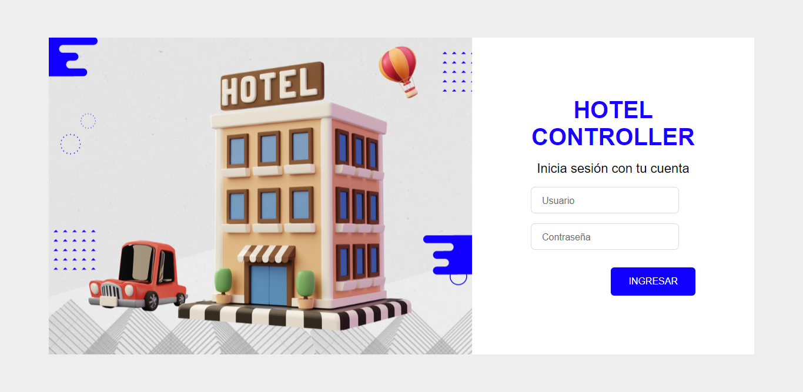
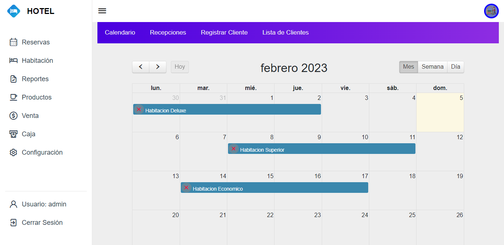
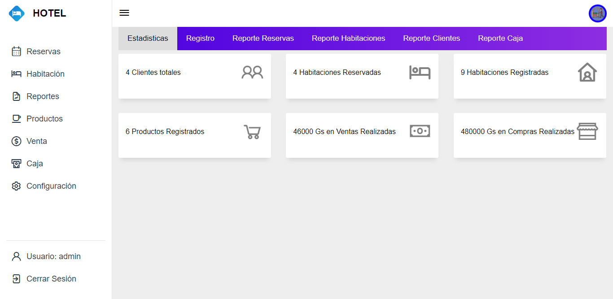

# Sistema para Hotel

Incluye el código fuente + manual de instalación y uso

# Los módulos son:

- Recepción
- Punto de venta
- Apertura y cierre de caja
- Clientes
- Reportes
- Configuración de tarifas
- Usuarios

Incluye Codigo fuente + Manual de Instalacion + Soporte tecnico
Desarrollado en php y Mysql como gestor de base de datos.
Adaptable a Celular, Pc, Tablet    

